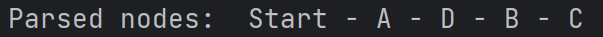
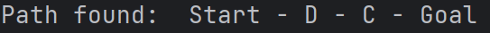

# Implementation of A* Search

## Table of content 

- [A* search](#a-search-)
- [Implementation](#implementation)
    - [Classes implemented](#classes-implemented)
    - [Algorithm](#algorithm)
- [Example](#example)
  - [Graph Implementation](#graph-implementation)
  - [Results](#results)


## A* Search 

In artificial intelligence, A* search is a widely used technique for graph exploration. It is an informed search: it is formulated in terms of weight graphs and uses a heuristic h(n) i.e. an estimation of the cost to the goal from a given node n.  

A* search expands one node at a time, selecting the path with the lowest cost by evaluating the expression:  

```math
f(n) = g(n) + h(n)
```

where :  
    - g is the cost to get from the start to n;  
    - h is the estimated cost to go from n to the goal;  
    - f the estimated cost of the cheapest solution through n.  

A* search meticulously expands nodes based on the computed lowest f value, thus seamlessly integrating backward (g) and forward (h) costs into its decision-making process.  

Operating on the principle of expanding paths with the lowest overall cost, this algorithm assures completeness : it guarantees a solution if one exists.
When the heuristic h is admissible - h(n) < real cost from n to goal - it also guarantees to find an optimal path: the path with the lowest cost.

## Implementation
### Classes implemented
In order to perform an A* search, we need to define two objects: nodes and graphs.  

A node is defined by its name and its heuristic h, which represents the estimation of the cost from the node to the goal. The heuristic is problem-dependent.  

``` python
def __init__(self, name="", h=0):
    self.name = name
    self.h = h
```

The Node class facilitates the computation of the f cost, which is a combination of the heuristic value and a given cost g. 
``` python
def f(self, g):
    return self.h + g
```

A graph is a collection of nodes, where each node has a list of successor nodes.
``` python
def __init__(self, successors):
    self.successors_list = successors
```
Initialized with a list of successors, the Graph class allows for the retrieval of successors for a given node through the find_successors method. 
``` python
def find_successors(self, node):
    return self.successors_list[node]
```
Thus, in this context, a graph can be understood as a set of interconnected nodes with defined relationships between them.

### Algorithm
For the implementation of A* search, the following steps have been used:

1. Initialize both the fringe and closed arrays.   
Fringe represents an array that contains nodes that have been spawned but have not been examined so far. We place the starting node into fringe.  
Closed represents an array that contains the nodes that are being examined. 

``` python
fringe = [starting_node]
closed = []
```
2. Initialize g_cost, f_cost and parents with the starting node info. 
g_cost is a dictionary that stores the lowest g_cost to a node, f_cost is a dictionary that stores the computed f_cost for each node and parents, which stores the parent of a node. 

``` python
g_cost = {starting_node: 0}
f_cost = {starting_node: starting_node.f(g_cost[starting_node])}
parents = {starting_node: None}
```

3. Remove the node from fringe having the smallest f_cost. If the two nodes have the same cost, select the current_node by alphabetical order.

``` python
current_node = None
for node in fringe:
    if current_node is None or f_cost[node] < f_cost[current_node]:
        current_node = node
    elif f_cost[node] == f_cost[current_node] and node.name < current_node.name:
        current_node = node
```

4. Test if the removed fringe is the goal node. If it is, returned the path found.

``` python
if current_node == goal_node:
    path_found = []
    while current_node:
        path_found.append(current_node)
        current_node = parents[current_node]
    path_found.reverse()

    print("Parsed nodes: ", end=" ")
    for index, node in enumerate(closed):
        print(node.name, end="")
        if index < len(closed) - 1:
            print(" - ", end="")

    print("\nPath found: ", end=" ")
    for node in path_found:
        if node.name != goal_node.name:
            print(node.name, end=" - ")
        else:
            print(node.name)
    return path_found
```

5. Remove the node from the FRINGE list and search for all its successors using the find_successor() function.

``` python
fringe.remove(current_node)
successors = graph.find_successors(current_node)
```

6. Find the value f(n) of all successors, put them in the fringe list, and put the deleted node in closed.

``` python
for (successor, weight) in successors:
    if successor not in closed:
        g_cost[successor] = g_cost[current_node] + weight
        if successor not in f_cost or successor.f(g_cost[successor]) <= f_cost[successor]:
            f_cost[successor] = successor.f(g_cost[successor])
            parents[successor] = current_node
        if successor not in fringe:
            fringe.append(successor)
closed.append(current_node)
```

7. Go to step 3 and iterate again.

8. Return null if no path have been found.

``` python
print("No path found")
return None
```

## Example
### Graph implementation
A simple example is performed. The situation is described with the following graph.


We expect the algorithm to be performed as followed:


We implement the nodes as following: 

``` python
start_node = Node("Start", 0)
A_node = Node("A", 2)
B_node = Node("B", 5)
C_node = Node("C", 2)
D_node = Node("D", 1)
goal_node = Node("Goal", 0)
```

We construct the successor list for each node: 

``` python
successors_list = {
    start_node: [(A_node, 2), (B_node, 3), (D_node, 5)],
    A_node: [(start_node, 2), (C_node, 4)],
    B_node: [(start_node, 3), (D_node, 4)],
    C_node: [(A_node, 4), (D_node, 1), (goal_node, 2)],
    D_node: [(start_node, 5), (B_node, 4), (C_node, 1), (goal_node, 5)],
    goal_node: [(C_node, 2), (D_node, 5)]
}
```

We then create the graph object:

``` python
graph_given = Graph(successors_list)
```

### Results

We perform the A* search on the graph created previously: 

``` python
path = a_star_search(graph_given, start_node, goal_node)
```

We obtain those parsed nodes are Start, A, D, B and C. The results obtained correspond to the one expected.  



The final path is Start - D - C - Goal.  



Another path can be retrieved and still be correct: Start - A - C - Goal.  
The path returned depends on the way we update the parent of a node. We update when we are looking at all the successors of a node. In the current code, we update it when the previous f_cost computed is superior or equal to the new f_cost.

``` python
if successor not in f_cost or successor.f(g_cost[successor]) <= f_cost[successor]:
    f_cost[successor] = successor.f(g_cost[successor])
    parents[successor] = current_node
```

Then, in this example, we go through the successors of A which are C and Start and C is given A as a parent. We then explore D and C is also a successor of D. The cost to go to C by A or by D is the same (equals to 8).

``` math
f(C) = h(C) + g(C) = 2 + (2 + 4) = 8
```

``` math
f(C) = h(C) + g'(C) = 2 + (5 + 1) = 8
```

As the two paths have the same cost, only the latest parent is conserved (here D) and it explains why the path is Start - D - C - Goal.  
It is possible to obtain the other path: Start - A - C - Goal. The only modification needed is to change the comparator from superior or equal to strictly superior: 

``` python
if successor not in f_cost or successor.f(g_cost[successor]) < f_cost[successor]:
    f_cost[successor] = successor.f(g_cost[successor])
    parents[successor] = current_node
```

With this code, it is possible to obtain the path: Start - A - C - Goal as C's parent isn't updated when the costs are equals. 


